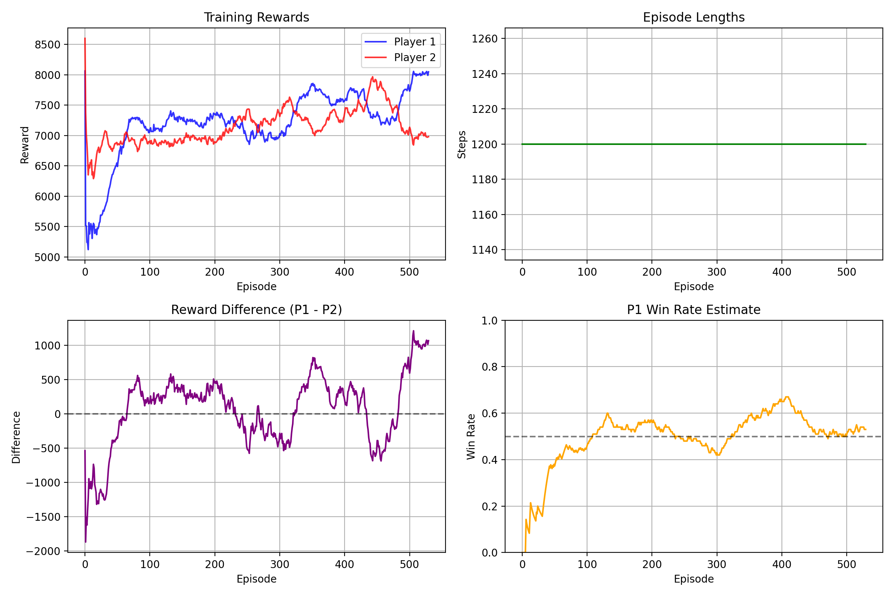

# DQN Air Hockey Game 🏒

A realistic air hockey game with Deep Q-Network (DQN) AI implementation using PyGame and PyTorch. Features advanced physics simulation, intelligent AI agents, and comprehensive training capabilities.

## 🎮 Features

### Realistic Physics Engine
- **Momentum & Friction**: Authentic puck and paddle movement with proper physics
- **Collision Detection**: Accurate paddle-puck and wall collision responses
- **Velocity Damping**: Realistic bouncing with energy loss
- **Smooth Controls**: Responsive paddle movement with velocity-based actions

### AI Capabilities
- **DQN Agent**: Deep Q-Learning with neural networks (512-256 architecture)
- **Simple AI**: Rule-based AI with adjustable difficulty levels
- **Reward System**: Comprehensive reward function with 11+ components
- **Training Environment**: Optimized for fast headless training

### Game Modes
- **Human vs AI**: Play against trained DQN or simple AI
- **Two Player**: Local multiplayer with keyboard controls
- **AI vs AI**: Watch trained agents compete
- **Training Mode**: Train DQN agents with visual or headless options
- **Testing Mode**: Evaluate trained models against benchmarks
